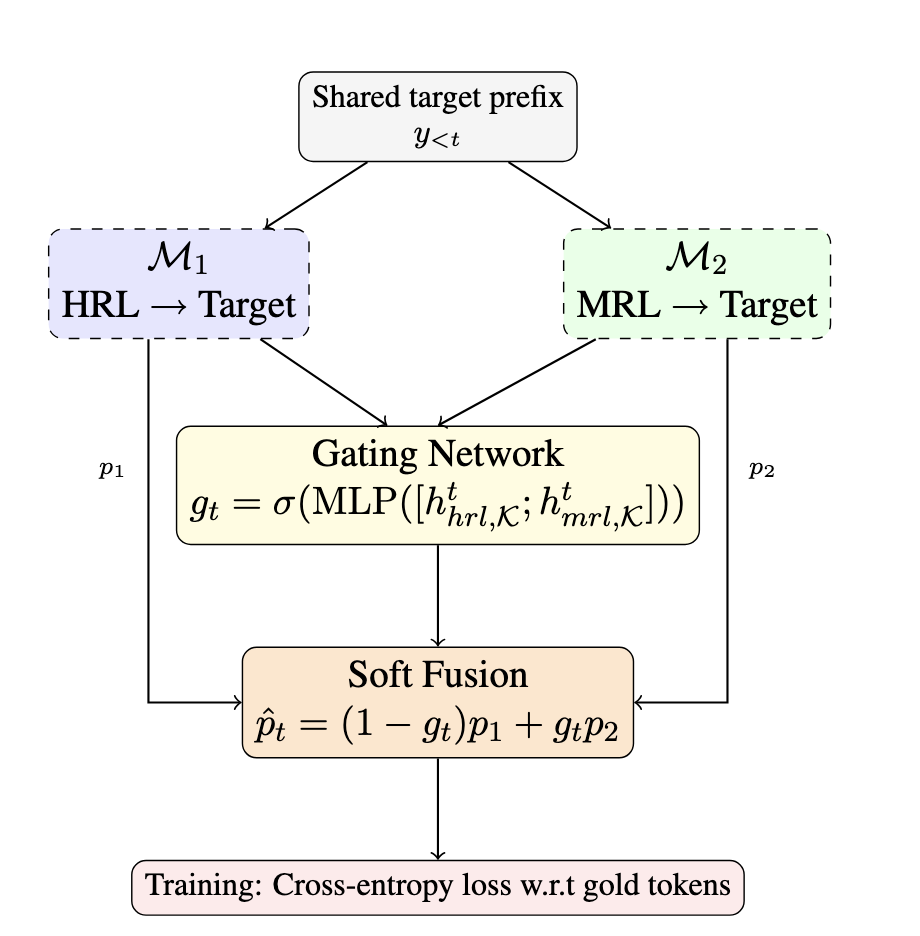

# ReCoG: Related-source Collaborative Decoding with Gating for Low-resource Machine Translation

[](https://aclanthology.org/)
[](LICENSE)
[](https://www.python.org/)

This is the official repository for the paper:

> **RECOG: Related-source Collaborative Decoding with Gating for Low-resource Machine Translation**  
> Sanjeev Kumar, Preethi Jyothi  
> Department of Computer Science and Engineering, IIT Bombay  
> *Findings of ACL 2026*

---

## Overview

**RECOG** is a lightweight collaborative decoding framework for Extremely Low-Resource Language (ELRL) machine translation. It fuses the token-level output distributions of two independently fine-tuned expert models — one trained on a High-Resource Language (HRL, e.g., English) and another on a typologically related Mid-Resource Language (MRL, e.g., Hindi) — via a learned gating network, without retraining the expert models.

<p align="center">
  
</p>

At each decoding step, a lightweight MLP computes a scalar gate value `g_t` from the final 3 decoder layers of both experts, softly combining their output distributions:

```
p̂_t = g_t · p1_t + (1 − g_t) · p2_t
```

RECOG is:
- **Architecture-agnostic**: supports both encoder–decoder (Aya-101) and decoder-only (Gemma, Qwen) models
- **Training-free for experts**: the expert models remain frozen during gating training
- **Scalable**: synthetic MRL inputs (generated via IndicTrans2 or Aya-101) can replace human-translated MRL data

### Key Results

- **+2.43 BLEU / +3.11 ChrF++** average improvement over HRL SFT baseline on Aya-101
- **+2.45 BLEU / +4.79 ChrF++** average improvement on Gemma-3
- Evaluated on **12 ELRLs** across **6 language families** and **4 scripts**
- Consistent gains on Qwen-3-8B as well (validated in Appendix)

---

## Repository Structure

```
ReCoG/
├── aya101/                          # Aya-101 (encoder–decoder) pipeline
│   ├── training/
│   │   └── recog_train.py           # Gating network training for Aya-101
│   └── inference/
│       └── recog_inference.py       # RECOG inference for Aya-101
│
├── gemma/                           # Gemma / Qwen (decoder-only) pipeline
│   ├── training/
│   │   ├── recog_train.py           # Gating network training (decoder-only)
│   │   └── recog_train_v2.py        # Alternate trainer with per-token masking
│   └── inference/
│       └── recog_inference.py       # RECOG inference for decoder-only models
│
├── baselines/
│   ├── concat/                      # Concatenation baseline (SFT on merged data)
│   │   ├── aya101_concat_train.py
│   │   ├── aya101_concat_inference.py
│   │   ├── gemma_concat_train.py
│   │   └── gemma_concat_inference.py
│   ├── heuristic/                   # Max-probability heuristic baseline
│   │   ├── aya101_heuristic.py
│   │   └── gemma_heuristic.py
│   └── fixed_ensemble/              # Fixed 0.5–0.5 ensemble baseline
│       └── aya101_fixed05_inference.py
│
├── scripts/                         # Ready-to-run example shell scripts
│   ├── run_aya101_recog.sh
│   ├── run_gemma_recog.sh
│   └── run_baselines.sh
│
├── data/
│   └── DATA.md                      # Dataset information and download instructions
│
├── requirements.txt
└── README.md
```

---

## Setup

### Requirements

```bash
pip install -r requirements.txt
```

**Hardware**: RECOG requires **2 GPUs** for training and inference (experts are placed on separate GPUs). Each Aya-101 expert needs ~40GB VRAM; each Gemma/Qwen expert needs ~16–20GB VRAM (bfloat16).

---

## Data

We use:
- **Training**: [NLLB Seed Corpus](https://huggingface.co/datasets/openlanguagedata/oldi_seed) (~6,193 sentence pairs per language)
- **Evaluation**: [FLORES-200] (1,012 samples)
- **Angika data**: from [Kumar et al., EACL 2026](https://huggingface.co/datasets/snjev310/AngikaMT)

Your data Excel file should contain columns for Source Language 1 (MRL), Source Language 2 (HRL = English), and the Target ELRL. See [`data/DATA.md`](data/DATA.md) for details.

---

## Usage

### Step 1: Fine-tune Expert Models (SFT)

Fine-tune two separate LoRA experts: one for `MRL → ELRL` and one for `HRL → ELRL`.

For **Aya-101**, use standard LoRA fine-tuning with prompts like:
```
translate Hindi to Magahi: <source sentence>
```

For **Gemma/Qwen**, use the prompt format:
```
Translate the following Hindi text to Magahi:

Input: <source sentence>

Response: <target sentence>
```

### Step 2: Train the Gating Network

**Aya-101:**
```bash
python aya101/training/recog_train.py \
  --excel_path data/NLLB_seed_train.xlsx \
  --sheet_name deva-indian \
  --base_model <path_to_aya101> \
  --lora_hi <path_to_mrl_lora_adapter> \
  --lora_en <path_to_hrl_lora_adapter> \
  --src1_col Hindi \
  --src2_col English \
  --tgt_col Magahi \
  --src1_lang Hindi \
  --src2_lang English \
  --tgt_lang Magahi \
  --output_gating_model gating_model_magahi.pt \
  --output_tokenizer_dir tokenizer_saved/
```

**Gemma / Qwen:**
```bash
CUDA_VISIBLE_DEVICES=0,1 python gemma/training/recog_train.py \
  --excel_path data/NLLB_seed_train.xlsx \
  --sheet_name deva-indian \
  --base_model <path_to_gemma> \
  --lora_hi <path_to_mrl_lora_adapter> \
  --lora_en <path_to_hrl_lora_adapter> \
  --src1_col Hindi \
  --src2_col English \
  --tgt_col Magahi \
  --src1_lang Hindi \
  --src2_lang English \
  --tgt_lang Magahi \
  --output_gating_model gemma_gating_magahi.pt \
  --output_tokenizer_dir tokenizer_saved/
```

### Step 3: Run RECOG Inference

**Aya-101:**
```bash
python aya101/inference/recog_inference.py \
  --base_model <path_to_aya101> \
  --lora_hi <path_to_mrl_lora_adapter> \
  --lora_en <path_to_hrl_lora_adapter> \
  --gating_model_path gating_model_magahi.pt \
  --excel_path data/flores_devtest.xlsx \
  --sheet_name flores-devtest \
  --src1_lang Hindi \
  --src2_lang English \
  --tgt_lang Magahi \
  --output_excel recog_output_magahi.xlsx
```

**Gemma / Qwen:**
```bash
CUDA_VISIBLE_DEVICES=0,1 python gemma/inference/recog_inference.py \
  --base_model <path_to_gemma> \
  --lora_hi <path_to_mrl_lora_adapter> \
  --lora_en <path_to_hrl_lora_adapter> \
  --gating_model_path gemma_gating_magahi.pt \
  --excel_path data/flores_devtest.xlsx \
  --sheet_name flores-devtest \
  --src1_lang Hindi \
  --src2_lang English \
  --tgt_lang Magahi \
  --output_file gemma_recog_output_magahi.xlsx
```

### Baselines

See [`scripts/run_baselines.sh`](scripts/run_baselines.sh) for ready-to-use commands for:
- **Concat**: single model fine-tuned on `HRL ||| MRL` concatenated input
- **Heuristic**: max-probability token selection at each step (no learned gate)
- **Fixed 0.5**: equal-weight probability averaging at each decoding step

---

## Language–MRL Mapping

Following the paper, we use the following MRL choices per language family:

| Target Language Family | Target Script | MRL Used | Rationale |
|---|---|---|---|
| Indo-Aryan (Angika, Magahi, Bhojpuri, Chhattisgarhi) | Devanagari | Hindi | Same genetic family and script |
| Tibeto-Burman (Meitei) | Bengali–Assamese | Bengali | Historical contact and script |
| Indo-Iranian (Kashmiri, Dari, Pashto) | Perso-Arabic | Urdu | Shared script and lexical overlap |
| Romance (Friulian, Sardinian) | Latin | Italian | Common Latin origin |
| African (Nigerian Fulfulde, Tamasheq) | Latin | French | Regional educational influence |

---

## Synthetic MRL Generation

When human-annotated MRL–ELRL pairs are unavailable, synthetic MRL inputs can be generated from HRL (English) using:
- **Indo-Aryan**: [IndicTrans2](https://github.com/AI4Bharat/IndicTrans2) for English → Hindi
- **Other families**: [Aya-101](https://huggingface.co/CohereForAI/aya-101) for English → MRL

This consistently improves BLEU in our experiments (see Table 2 in the paper), as synthetic MRL preserves HRL lexical structure, enabling more balanced gating.

---

## Citation

If you use RECOG in your work, please cite:

```bibtex
@inproceedings{kumar-jyothi-2026-recog,
  title     = {{RECOG}: Related-source Collaborative Decoding with Gating for Low-resource Machine Translation},
  author    = {Kumar, Sanjeev and Jyothi, Preethi},
  booktitle = {Findings of the Association for Computational Linguistics: ACL 2026},
  year      = {2026},
  address   = {},
  publisher = {Association for Computational Linguistics},
}
```

---

## Acknowledgements

The first author gratefully acknowledges Ph.D. fellowship support from the **TCS Research Foundation**. The second author gratefully acknowledges financial support from the **Amazon–IITB AI/ML Initiative**. We thank the anonymous reviewers for their insightful and constructive comments.

---

## License

This project is licensed under the MIT License. See [LICENSE](LICENSE) for details.
